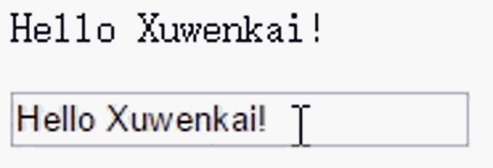
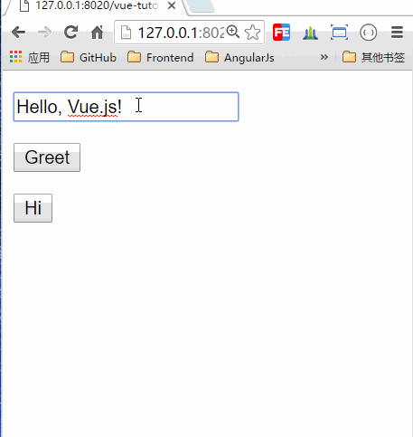

Vue.js
===================
----------

一、Vue.js简介
-------------
----------
### Vue.js 是什么

Vue.js（读音 /vjuː/，类似于 view） 是一套构建用户界面的渐进式框架。与其他重量级框架不同的是，Vue 采用自底向上增量开发的设计。Vue 的核心库只关注视图层，它不仅易于上手，还便于与第三方库或既有项目整合。另一方面，当与单文件组件和 Vue 生态系统支持的库结合使用时，Vue 也完全能够为复杂的单页应用程序提供驱动。

### Vue.js框架的引用

你也可以创建一个本地的<kbd>.html</kbd>文件，然后通过如下方式引入 <kbd>Vue</kbd>：

```
  <script src="https://unpkg.com/vue/dist/vue.js"></script>
```

或者直接下载并用 <kbd> "《script》" </kbd> 标签引入，<kbd>Vue</kbd> 会被注册为一个全局变量:

```
  <script src="js/vue.js"></script>
```

二、Vue.js特点
-------------
----------
### 1.声明式渲染
Vue.js 的核心是一个允许采用简洁的模板语法来声明式的将数据渲染进 DOM：

html:
```
<div id="app">
  {{ message }}
</div>
```
JS:
```
var app = new Vue({
  el: '#app',
  data: {
    message: 'Hello Vue!'
  }
})
```

效果：


 <kbd>Vue.js</kbd>是数据驱动的，无需手动操作DOM。

 它通过一些特殊的HTML语法，将DOM和数据绑定起来。一旦你创建了绑定，DOM将和数据保持同步，每当变更了数据，DOM也会相应的更新。

 看起来这跟单单渲染一个字符串模板非常类似，但是 Vue 在背后做了大量工作。现在数据和 DOM 已经被绑定在一起，所有的元素都是**响应式**的。

修改 <kbd>app.message</kbd>，你将看到上例相应地更新。


---

### 2.MVVM模式——数据绑定

下图不仅概括了MVVM模式（Model-View-ViewModel），还描述了在Vue.js中ViewModel是如何和View以及Model进行交互的。


**ViewModel是Vue.js的核心，它是一个Vue实例。** Vue实例是作用于某一个HTML元素上的，这个元素可以是HTML的body元素，也可以是指定了id的某个元素。

当创建了ViewModel后，双向绑定是如何达成的呢？

首先，我们将上图中的DOM Listeners和Data Bindings看作两个工具，它们是实现双向绑定的关键。

从View侧看，ViewModel中的DOM Listeners工具会帮我们监测页面上DOM元素的变化，如果有变化，则更改Model中的数据；

从Model侧看，当我们更新Model中的数据时，Data Bindings工具会帮我们更新页面中的DOM元素。

示例：

```
<html>
    <head>
        <meta charset="UTF-8">
        <title></title>
    </head>

    <body>
        <!--这是我们的View-->
        <div id="app">
            {{ message }}
        </div>
    </body>
    <script src="js/vue.js"></script>
    <script>
        // 这是我们的Model
        var exampleData = {
            message: 'Hello World!'
        }

        // 创建一个 Vue 实例或 "ViewModel"
        // 它连接 View 与 Model
        new Vue({
            el: '#app',
            data: exampleData
        })
    </script>
</html>

```
使用Vue的过程就是定义MVVM各个组成部分的过程的过程。

> - 1.定义View
> - 2.定义Model
> - 3.创建一个Vue实例或"ViewModel"，它用于连接View和Model

在创建Vue实例时，需要传入一个 **选项对象** ，选项对象可以包含数据、挂载元素、方法、模生命周期钩子等等。

在这个示例中， **选项对象** 的 **el属性** 指向View，<kbd>el: '#app'</kbd>表示该Vue实例将挂载到<kbd>《div id="app">...《/div》 </kbd>这个元素；<kbd>data</kbd>属性指向 Model，<kbd>data: exampleData</kbd>表示我们的Model是exampleData对象。

Vue.js有多种数据绑定的语法，最基础的形式是文本插值，使用一对大括号语法，在运行时<kbd>{{ message }}</kbd>会被数据对象的message属性替换，所以页面上会输出"Hello World!"。

#### 双向绑定示例

MVVM模式本身是实现了双向绑定的，在Vue.js中可以使用<kbd>v-model</kbd>指令在表单元素上创建双向数据绑定。

```
<!--这是我们的View-->
<div id="app">
    <p>{{ message }}</p>
    <input type="text" v-model="message"/>
</div>

```
将message绑定到文本框，当更改文本框的值时，<kbd>>p>{{ message }}>/p></kbd> 中的内容也会被更新。



反过来，如果改变message的值，文本框的值也会被更新，我们可以在Chrome控制台进行尝试。


> Vue实例的data属性指向exampleData，它是一个引用类型，改变了exampleData对象的属性，同时也会影响Vue实例的data属性。

----

### 3.组件化应用
组件系统是Vue.js其中一个重要的概念，它提供了一种抽象，让我们可以使用独立可复用的小组件来构建大型应用，任意类型的应用界面都可以抽象为一个组件树：


那么什么是组件呢？

**组件可以扩展HTML元素，封装可重用的HTML代码，我们可以将组件看作自定义的HTML元素。**

在 Vue 里，一个组件本质上是一个拥有预定义选项的一个 Vue 实例，在 Vue 中注册组件很简单：

```
// 定义名为 todo-item 的新组件
Vue.component('todo-item', {
  template: '<li>这是个待办项</li>'
})
```

现在你可以用它构建另一个组件模板：

```
<ol>
  <!-- 创建一个 todo-item 组件的实例 -->
  <todo-item></todo-item>
</ol>
```

但是这样会为每个待办项渲染同样的文本，这看起来并不炫酷，我们应该能将数据从父作用域传到子组件。让我们来修改一下组件的定义，使之能够接受一个属性：

```
Vue.component('todo-item', {
  // todo-item 组件现在接受一个
  // "prop"，类似于一个自定义属性
  // 这个属性名为 todo。
  props: ['todo'],
  template: '<li>{{ todo.text }}</li>'
})
```

现在，我们可以使用 <kbd>v-bind</kbd> 指令将待办项传到每一个重复的组件中：

```
<div id="app-7">
  <ol>
    <!-- 现在我们为每个todo-item提供待办项对象    -->
    <!-- 待办项对象是变量，即其内容可以是动态的 -->
    <todo-item v-for="item in groceryList" v-bind:todo="item"></todo-item>
  </ol>
</div>
```

```
Vue.component('todo-item', {
  props: ['todo'],
  template: '<li>{{ todo.text }}</li>'
})
var app7 = new Vue({
  el: '#app-7',
  data: {
    groceryList: [
      { text: '蔬菜' },
      { text: '奶酪' },
      { text: '随便其他什么人吃的东西' }
    ]
  }
})
```

效果：


在控制台里，输入 <bkd>app7.groceryList.push({ text: '新项目1' })</bkd> ，你会发现列表中添加了一个新项。


### 4.简单、轻量、小巧

下面看一段Angular的实现双向绑定的代码：

```
// html
<body ng-app="myApp">
    <div ng-controller="myCtrl">
        <p>{{ note }}</p>
        <input type="text" ng-model="note">
    </div>
</body>

// js
var myModule = angular.module('myApp', []);

myModule.controller('myCtrl', ['$scopp', function($scope) {
    $scope.note = '';
]);
```

然后再看一下Vue的代码:

```
// html
<body>
    <div id="app">
        <p>{{ note }}</p>
        <input type="text" v-model="note">
    </div>
</body>

// js
var vm = new Vue({
    el: '#app',
    data: {
        note: ''
    }
})
```

相比较而言我个人认为Vue的代码编写风格更加简洁，并且通俗易懂。

Vue虽然是一个比较轻量级的框架，简单轻量的同时还非常的人性化，其提供的API也是非常的容易理解，同时也提供了一些很便捷的指令和属性。

说起小巧，那应该首先要关注下Vue的源码大小，Vue的成产版本（即min版）源码仅为72.9kb，官网称gzip压缩后只有25.11kb，相比Angular的144kb缩小了一半。

小巧的一种好处就是可以让用户更自由的选择相应的解决方案，在配合其他库方面它给了用户更大的空间。

---

三、Vue.js的常用指令
-------------
----------

上面用到的<kbd>v-model</kbd>是Vue.js常用的一个指令，那么指令是什么呢？

>**Vue.js的指令是以v-开头的，它们作用于HTML元素，指令提供了一些特殊的特性，将指令绑定在元素上时，指令会为绑定的目标元素添加一些特殊的行为，我们可以将指令看作特殊的HTML特性（attribute）。**

Vue.js提供了一些常用的内置指令，接下来将介绍以下几个内置指令：

> - v-if指令
> - v-show指令
> - v-else指令
> - v-for指令
> - v-bind指令
> - v-on指令

---

#### v-if指令

<kbd>v-if</kbd>是条件渲染指令，它根据表达式的真假来删除和插入元素，它的基本语法如下：

```
v-if="expression"
```

expression是一个返回bool值的表达式，表达式可以是一个bool属性，也可以是一个返回bool的运算式。例如：

```
<!DOCTYPE html>
<html>
    <head>
        <meta charset="UTF-8">
        <title></title>
    </head>
    <body>
        <div id="app">
            <h1>Hello, Vue.js!</h1>
            <h1 v-if="yes">Yes!</h1>
            <h1 v-if="no">No!</h1>
            <h1 v-if="age >= 25">Age: {{ age }}</h1>
            <h1 v-if="name.indexOf('jack') >= 0">Name: {{ name }}</h1>
        </div>
    </body>
    <script src="js/vue.js"></script>
    <script>

        var vm = new Vue({
            el: '#app',
            data: {
                yes: true,
                no: false,
                age: 28,
                name: 'keepfool'
            }
        })
    </script>
</html>
```


这段代码使用了4个表达式：

> - 数据的<kbd>yes</kbd>属性为true，所以 **"Yes!"** 会被输出；
> - 数据的<kbd>no</kbd>属性为false，所以 **"No!"** 不会被输出；
> - 运算式<kbd>age >= 25</kbd>返回true，所以 **"Age: 28"** 会被输出；
> - 运算式<kbd>name.indexOf('jack') >= 0</kbd>返回false，所以 **"Name: keepfool"** 不会被输出。

> **注意：** v-if指令是根据条件表达式的值来执行 **元素的插入或者删除行为** 。

这一点可以从渲染的HTML源代码看出来，面上只渲染了3个>h1>元素，<kbd>v-if</kbd>值为false的>h1>元素没有渲染到HTML。


为了再次验证这一点，可以在Chrome控制台更改age属性，使得表达式<kbd>age >= 25</kbd>的值为false，可以看到<kbd>>h1>Age: 28>/h1></kbd>元素被删除了。


age是定义在选项对象的data属性中的，为什么Vue实例可以直接访问它呢？

这是因为 **每个Vue实例都会代理其选项对象里的data属性** 。

#### v-show指令

<kbd>v-show</kbd>也是条件渲染指令，和<kbd>v-if</kbd>指令不同的是，使用<kbd>v-show</kbd>指令的元素始终会被渲染到HTML，它只是简单地为元素设置CSS的style属性。

```
//HTML
<html>
    <head>
        <meta charset="UTF-8">
        <title></title>
    </head>
    <body>
        <div id="app">
            <h1>Hello, Vue.js!</h1>
            <h1 v-show="yes">Yes!</h1>
            <h1 v-show="no">No!</h1>
            <h1 v-show="age >= 25">Age: {{ age }}</h1>
            <h1 v-show="name.indexOf('jack') >= 0">Name: {{ name }}</h1>
        </div>
    </body>
    <script src="js/vue.js"></script>
    <script>

        var vm = new Vue({
            el: '#app',
            data: {
                yes: true,
                no: false,
                age: 28,
                name: 'keepfool'
            }
        })
    </script>
</html>

```


在Chrome控制台更改age属性，使得表达式<kbd>age >= 25</kbd>的值为false，可以看到<kbd>>h1>Age: 24>/h1></kbd>元素被设置了style="display:none"样式。


---

#### v-else指令

可以用<kbd>v-else</kbd>指令为<kbd>v-if</kbd>或<kbd>v-show</kbd>添加一个“else块”。<kbd>v-else</kbd>元素必须立即跟在<kbd>v-if</kbd>或<kbd>v-show</kbd>元素的后面——否则它不能被识别。

```
//html
<html>

    <head>
        <meta charset="UTF-8">
        <title></title>
    </head>
    <body>
        <div id="app">
            <h1 v-if="age >= 25">Age: {{ age }}</h1>
            <h1 v-else>Name: {{ name }}</h1>
            <h1>---------------------分割线---------------------</h1>
            <h1 v-show="name.indexOf('keep') >= 0">Name: {{ name }}</h1>
            <h1 v-else>Sex: {{ sex }}</h1>
        </div>
    </body>
    <script src="js/vue.js"></script>
    <script>
        var vm = new Vue({
            el: '#app',
            data: {
                age: 28,
                name: 'keepfool',
                sex: 'Male'
            }
        })
    </script>
</html>

```

<kbd>v-else</kbd>元素是否渲染在HTML中，取决于前面使用的是<kbd>v-if</kbd>还是<kbd>v-show</kbd>指令。
这段代码中<kbd>v-if</kbd>为true，后面的<kbd>v-else</kbd>不会渲染到HTML；<kbd>v-show</kbd>为tue，但是后面的<kbd>v-else</kbd>仍然渲染到HTML了。


---

#### v-for指令

<kbd>v-for</kbd>指令基于一个数组渲染一个列表，它和JavaScript的遍历语法相似：

```
v-for="item in items"
```

items是一个数组，item是当前被遍历的数组元素。

```

//html
<html>

    <head>
        <meta charset="UTF-8">
        <title></title>
        <link rel="stylesheet" href="styles/demo.css" />
    </head>

    <body>
        <div id="app">
            <table>
                <thead>
                    <tr>
                        <th>Name</th>
                        <th>Age</th>
                        <th>Sex</th>
                    </tr>
                </thead>
                <tbody>
                    <tr v-for="person in people">
                        <td>{{ person.name  }}</td>
                        <td>{{ person.age  }}</td>
                        <td>{{ person.sex  }}</td>
                    </tr>
                </tbody>
            </table>
        </div>
    </body>
    <script src="js/vue.js"></script>
    <script>
        var vm = new Vue({
            el: '#app',
            data: {
                people: [{
                    name: 'Jack',
                    age: 30,
                    sex: 'Male'
                }, {
                    name: 'Bill',
                    age: 26,
                    sex: 'Male'
                }, {
                    name: 'Tracy',
                    age: 22,
                    sex: 'Female'
                }, {
                    name: 'Chris',
                    age: 36,
                    sex: 'Male'
                }]
            }
        })
    </script>

</html>

```


我们在选项对象的data属性中定义了一个people数组，然后在#app元素内使用<kbd>v-for</kbd>遍历people数组，输出每个person对象的姓名、年龄和性别。

---

#### v-bind指令

<kbd>v-bind</kbd>指令可以在其名称后面带一个参数，中间放一个冒号隔开，这个参数通常是HTML元素的特性（attribute），例如：<kbd>v-bind:class</kbd>

下面这段代码构建了一个简单的分页条，<kbd>v-bind</kbd>指令作用于元素的class特性上。
这个指令包含一个表达式，表达式的含义是： **高亮当前页** 。

```
//html

<html>
    <head>
        <meta charset="UTF-8">
        <title></title>
        <link rel="stylesheet" href="styles/demo.css" />
    </head>
    <body>
        <div id="app">
            <ul class="pagination">
                <li v-for="n in pageCount">
                    <a href="javascripit:void(0)" v-bind:class="activeNumber === n + 1 ? 'active' : ''">{{ n + 1 }}</a>
                </li>
            </ul>
        </div>
    </body>
    <script src="js/vue.js"></script>
    <script>
        var vm = new Vue({
            el: '#app',
            data: {
                activeNumber: 1,
                pageCount: 10
            }
        })
    </script>
</html>
```


v-bind的缩写

Vue.js为常用的指令<kbd>v-bind</kbd>指令提供了缩写。 **<kbd>v-bind</kbd>指令可以缩写为一个冒号。**

```
<!--完整语法-->
<a href="javascripit:void(0)" v-bind:class="activeNumber === n + 1 ? 'active' : ''">{{ n + 1 }}</a>
<!--缩写语法-->
<a href="javascripit:void(0)" :class="activeNumber=== n + 1 ? 'active' : ''">{{ n + 1 }}</a>

```

---

#### v-on指令

<kbd>v-on</kbd>指令用于给监听DOM事件，它的用语法和<kbd>v-bind</kbd>是类似的，例如监听>a>元素的点击事件：

```
<a v-on:click="doSomething">
```

有两种形式调用方法：绑定一个方法（让事件指向方法的引用），或者使用内联语句。

Greet按钮将它的单击事件直接绑定到greet()方法，而Hi按钮则是调用say()方法。

```
//html

<html>
    <head>
        <meta charset="UTF-8">
        <title></title>
    </head>
    <body>
        <div id="app">
            <p><input type="text" v-model="message"></p>
            <p>
                <!--click事件直接绑定一个方法-->
                <button v-on:click="greet">Greet</button>
            </p>
            <p>
                <!--click事件使用内联语句-->
                <button v-on:click="say('Hi')">Hi</button>
            </p>
        </div>
    </body>
    <script src="js/vue.js"></script>
    <script>
        var vm = new Vue({
            el: '#app',
            data: {
                message: 'Hello, Vue.js!'
            },
            // 在 `methods` 对象中定义方法
            methods: {
                greet: function() {
                    // // 方法内 `this` 指向 vm
                    alert(this.message)
                },
                say: function(msg) {
                    alert(msg)
                }
            }
        })
    </script>
</html>
```



v-on的缩写

Vue.js也为常用的指令<kbd>v-on</kbd>指令提供了缩写。 **<kbd>v-on</kbd>指令可以缩写为@符号。**

```
<!--完整语法-->
<button v-on:click="greet">Greet</button>
<!--缩写语法-->
<button @click="greet">Greet</button>
```

---

四、Vue.js的一个简单demo
-------------
----------

通过上面的Vue.js知识的学习之后，简单做了一个demo——图书管理。

```
//html

<html lang="en">

<head>
<script src="http://cdnjs.cloudflare.com/ajax/libs/vue/1.0.7/vue.min.js"></script>
  <script src="https://cdnjs.cloudflare.com/ajax/libs/vue-resource/0.1.17/vue-resource.js"></script>
    <meta charset="UTF-8">
    <title>Veu.js_Demo</title>
    <link rel="stylesheet" type="text/css" href="https://cdn.bootcss.com/bootstrap/3.3.5/css/bootstrap.min.css">

</head>

<body>
    <div class="container">
        <div class="col-md-6 col-md-offset-3">
            <h1> 图书管理 </h1>
            <div id="app">
              <table class="table table-hover" v-cloak>
                <thead>
                  <tr>

                    <th class="text-right">序号</th>
                    <th class="text-right">书名</th>
                    <th class="text-right">作者</th>
                    <th class="text-right">价格</th>
                    <th class="text-right">操作</th>
                  </tr>
                </thead>
                <tbody>
                  <tr v-for="book in books">
                    <td class="text-right">{{book.id}}</td>
                    <td class="text-right">{{book.name}}</td>
                    <td class="text-right">{{book.author}}</td>
                    <td class="text-right">{{book.price}}</td>
                    <template v-if="book.id%2==0">
                        <td class="text-right">
                            <button type="button" class="btn btn-success" v-on:click="delBook(book)">删除</button>
                        </td>
                    </template>
                    <template v-else>
                         <td class="text-right">
                            <button type="button" class="btn btn-danger" v-on:click="delBook(book)">删除</button>
                         </td>
                    </template>
                  </tr>
                  <tr>
                    <td class="text-right" colspan="5">
                      <h4>总价：{{sum}}</h4>
                    </td>
                  </tr>
                </tbody>
              </table>
              <div id="add-book">
                <legend>添加书籍</legend>
                <div class="form-group">
                  <label>书名</label>
                  <input type="text" class='form-control' v-model="book.name">
                </div>
                 <div class="form-group">
                  <label>作者</label>
                  <input type="text" class='form-control' v-model="book.author">
                </div>
                 <div class="form-group">
                  <label>价格</label>
                  <input type="text" class='form-control' v-model="book.price">
                </div>
                 <button class="btn btn-primary btn-block" @click="addBook()">添加</button>
              </div>
            </div>
        </div>
    </div>
    <script>
    var app = new Vue({
      el:"#app",

      data:{
        sortparam:'',
        book:{
          id:0,
          author:'',
          name:'',
          price:''
        },

        books: [{
                    id: 1,
                    author: 'JavaScript',
                    name: '编程精读',
                    price: 32.0
                }, {
                    id: 2,
                    author: '周苏',
                    name: '创新思维',
                    price: 30.0
                }, {
                    id: '3',
                    author: 'Android',
                    name: '第一行代码',
                    price: 24.0
                }]
      },
      computed:{
        sum:function(){
          var result = 0;
          for (var i=0;i<this.books.length;i++){
            result += Number(this.books[i].price)
          };
          return result;
        }
      },
      methods:{
        addBook:function(){
          this.book.id = this.books.length +1;
          this.books.push(this.book);
          this.book = '';
        },
        delBook:function(book){
          this.books.$remove(book);
        }
      }
    });
    </script>

</body>

</html>

```

示例：


